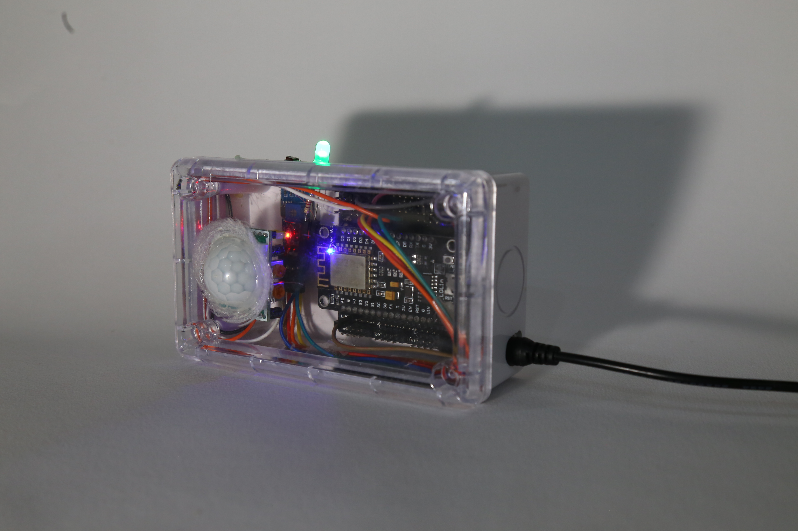

# Motion_Detect
This repository is about Arduino with motion senser and diode sensor

## Property
- Motion Sensor 1
- Diode Sensor
- Buzzer
- Led
- Esp8266 V.2
- Jumper Male-Female, Female-Female

## Example sage

## How it work
1. Let begin with turn on switch.
2. Everthing will set up.
3. Motion sensor will scan if there has something move on motion area (180 degree).
  - Buzz sensor will activated
  - Esp8266 will send message to user
  - OLED display will show text found people
4. If not nothing happend.

## Benefits
1. Prepare for safety.
2. your personal property will be safe.
3. High security

## Next version
In a near-future idefinite add
- Camera (Esp32) for capture an picture
- Reduce Error rate 10% -> 5%
- Get new boxa
